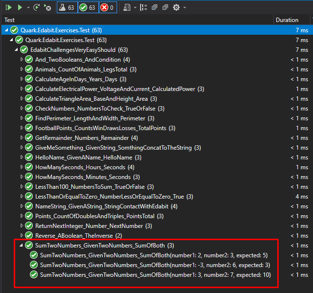

# Quark Edabit Exercises

Project to practice the Unit tests coding. The objective of this project is to apply the TDD practice.

# Table of Contents

- [Table of Contents](#table-of-contents)
  - [Prerequisites](#prerequisites)
  - [Folders Structure](#folders-structure)
  - [How Create a Unit Test](#how-create-a-unit-test)
  - [Name Convention](#name-convention)
    - [Class Names](#class-names)
    - [Unit Test Names](#unit-test-names)

## Prerequisites

In this project we use the followeing tools:

- Visual Studio 2019
- XUnit Framework
- .Net Core 3.1 (LTS)

## Folders Structure

We created two projects, one for the unit tests and the other for the code of the solution.

```
QuarkEdabitUnitTests
│   README.md
|   CONTRIBUTING.md
│   .gitignore
│
└───Quark.Edabit.Exercises
│   │   Quark.sln
│   │
│   └───Quark.Edabit.Exercises
|       |   EdabitChallengesVeryEasy.cs
│       │   EdabitChallengesEasy.cs
│       │   EdabitChallengesMedium.cs
│       │   Quark.Edabit.Exercises.csproj
│
└───Quark.Edabit.Exercises.Test
    |   EdabitChallengesVeryEasyShould.cs
    │   EdabitChallengesEasyShould.cs
    │   EdabitChallengesMediumShould.cs
    |   Quark.Edabit.Exercises.Test.csproj
```

## How Create a Unit Test

When we create a unit test, first we need to determine which class or module we going to test, this class is the **SUT** (Subject Under Test).

If we want test the methods of the class **EdabitChallengesVeryEasy**, then it will be our **sut**.
This sut will be defined in the test class EdabitChallengesVeryEasyShould how a private atribute. In order to the have a new instance of the sut in each test, we will inicialize the sut in the constructor of the Test Class (in other Frameworks it is done using the BeforeEach method or something similar).

Example:

Make the test and solution for the following statement:
_Create a function that takes two numbers as arguments and returns their sum._

Test

```C#
        [Theory]
        [InlineData(2, 3, 5)]
        [InlineData(-3, 6, 3)]
        [InlineData(3, 7, 10)]
        public void SumTwoNumbers_GivenTwoNumbers_SumOfBoth(int number1, int number2, int expected)
        {
            /// Act
            var result = _sut.Sum(number1, number2);
            /// Assert
            Assert.Equal(expected, result);
        }

```

solution

```C#
        public int Sum(int a, int b)
        {
            return a + b;
        }

```

All test pass



## Name Convention

### Class Names

To name the Test Classes we following the next convention :

**[ClassName]Should**

### Unit Test Names

To name the unit test we following the next convention :

**MethodName_StateUnderTest_ExpectedBehavior**

## Contributing

Our contributing guidelines can be found here [contributing.md](CONTRIBUTING.md).
